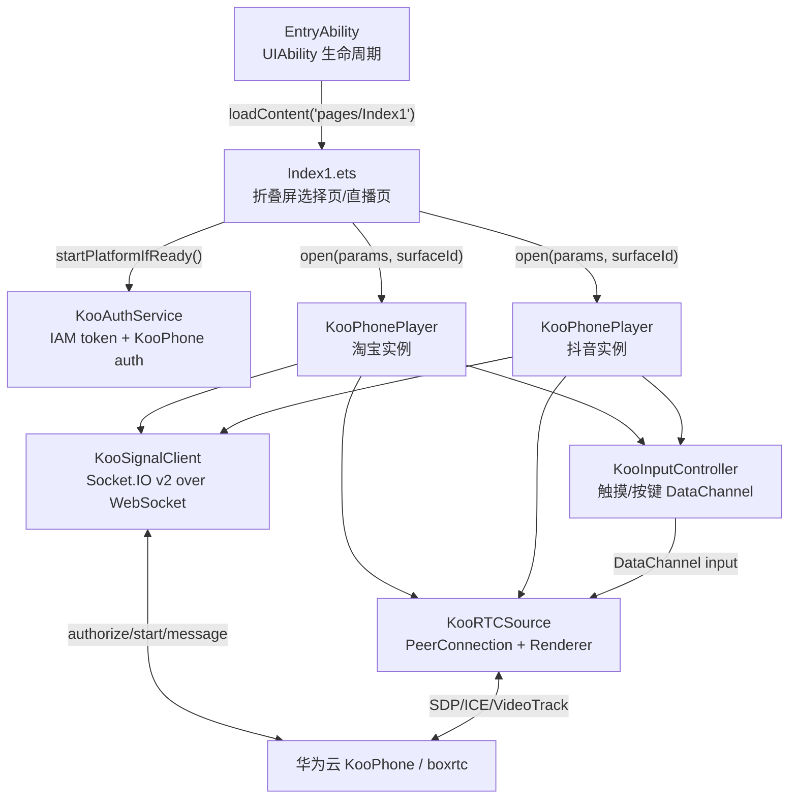
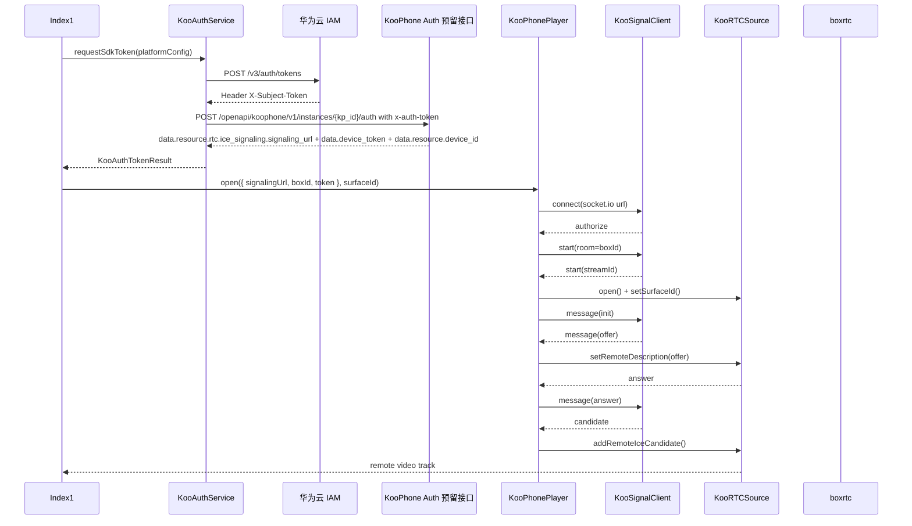

# KooPhone 折叠屏直播端到端调试指南

## 1. 从哪里开始看

鸿蒙应用主入口在 `entry/src/main/ets/entryability/EntryAbility.ets`。

启动链路：

```text
EntryAbility.onCreate()
  -> EntryAbility.onWindowStageCreate(windowStage)
  -> windowStage.loadContent('pages/Index1')
  -> entry/src/main/ets/pages/Index1.ets
```

页面不是通过传统 Web 路由跳转进入的，而是 Stage 模型下 `UIAbility` 创建窗口后，调用 `windowStage.loadContent('pages/Index1')` 直接加载 ArkUI 页面。`entry/src/main/resources/base/profile/main_pages.json` 中声明了 `pages/Index1`，所以该页面可以被 `loadContent` 找到。

## 2. 当前代码架构



## 3. 点击后代码怎么走

选择页由 `Index1.selectionPage()` 构建。

平台选择链路：

```text
platformOption(platform, title)
  -> onClick()
  -> togglePlatform(platform)
  -> selectedTaobao / selectedDouyin 状态变化
  -> selectIndicator(platform) 重绘选中圆点
  -> 开始直播按钮根据 hasSelection() 变灰或变红
```

开始直播链路：

```text
开始直播按钮 onClick()
  -> startSelectedStreams()
  -> shouldStartTaobao / shouldStartDouyin 记录要启动的平台
  -> isLiveStarted = true 进入直播页
  -> livePage()
  -> liveContent()
  -> streamPanel(platform)
  -> taobaoSurface() / douyinSurface()
  -> XComponent.onLoad()
  -> getXComponentSurfaceId()
  -> startPlatformIfReady(platform)
```

`startSelectedStreams()` 不直接串流，因为这时 `XComponent` 可能还没有拿到 `surfaceId`。真正调用 SDK 的地方是 `startPlatformIfReady(platform)`。

## 4. 串流鉴权和 open 流程

每一路直播都独立走同样流程：



IAM token 与 KooPhone SDK token 是两种不同 token：

- IAM token：来自 IAM `X-Subject-Token` 响应头，用于调用云服务接口。
- KooPhone SDK token：来自 KooPhone 实例鉴权响应 `data.device_token`，传给 `KooPhonePlayer.open()`，按当前业务约束只有约 15 秒有效期。

因此每次启动或自动重试都会重新调用 `KooAuthService.requestSdkToken()`，不会复用旧 SDK token。

KooPhone 实例鉴权响应字段映射：

| 响应字段 | SDK 参数 | 说明 |
|---|---|---|
| `data.resource.rtc.ice_signaling.signaling_url` | `KooPhoneParams.signalingUrl` | 信令服务地址 |
| `data.device_token` | `KooPhoneParams.token` | 短效 SDK token |
| `data.resource.device_id` | `KooPhoneParams.boxId` | 云手机设备 ID |
| `data.streamingId` | `KooPhoneParams.streamingId` | 有返回时透传给信令连接 |
| `data.resource.rtc.ice_signaling.ice_servers` | `KooPhoneParams.iceServers` | 有 ICE server 时透传给 WebRTC |

## 5. 折叠屏布局逻辑

`Index1.isExpandedScreen()` 使用 `rootWidth >= 700` 判断展开屏。`rootWidth` 来自根组件 `onAreaChange()`。

未开始直播：

- 展开屏和外屏都显示同一套选择页。
- 淘宝/抖音支持单选、双选。
- 未选择时开始按钮为灰色，点击直接 return。

开始直播后：

- 展开屏：`liveContent()` 使用左右分栏。
- 外屏/窄屏：只展示 `getPrimaryPlatform()` 返回的主直播。
- 主直播规则：优先淘宝；如果只选抖音，抖音显示在左侧或外屏。
- 双选但当前是外屏时，只显示主直播；展开后第二路 `XComponent` 加载，随后触发第二路 `startPlatformIfReady()`。
- 直播态“停止串流”按钮覆盖在右下角，避免遮挡每路顶部状态浮层。

## 6. 重试逻辑

每个平台独立维护：

- `taobaoRetryCount / douyinRetryCount`
- `taobaoStarting / douyinStarting`
- `taobaoStarted / douyinStarted`
- `taobaoErrorText / douyinErrorText`

失败入口：

```text
Auth 失败
  -> startPlatformIfReady() catch
  -> schedulePlatformRetry()

WebSocket / WebRTC 失败
  -> KooSignalClient.onError 或 KooPhonePlayer.onError
  -> Index1.handlePlatformError()
  -> schedulePlatformRetry()
```

重试策略：

- 最多自动重试 3 次。
- 延迟分别是 800ms、1600ms、2400ms。
- 每次重试都会重新获取 SDK token。
- 双选时两路互不影响。

## 7. 如何端到端调试

1. 打开工程：

```bash
open -a /Applications/DevEco-Studio.app /Users/wangrui/Documents/Codex/2026-06-04/spikex-21-livekit-https-github-com/livekit
```

2. 确认依赖：

```bash
ohpm install
```

3. 编译：

```bash
hvigorw clean assembleApp --no-daemon --stacktrace -p properties.enableSignTask=false
```

4. 启动 Mate X7 模拟器：

```bash
/Applications/DevEco-Studio.app/Contents/tools/emulator/Emulator \
  -start Mate_X7_LiveKit \
  -instancePath /Users/wangrui/.Huawei/Emulator/deployed \
  -imageRoot /Users/wangrui/Library/Huawei/Sdk \
  -bootmode coldboot
```

5. 安装并启动：

```bash
hdc -t 127.0.0.1:5555 install -r entry/build/default/outputs/default/app/entry-default.hap
hdc -t 127.0.0.1:5555 shell aa start -b com.hssw.livekit -a EntryAbility
```

6. 截图验证：

```bash
hdc -t 127.0.0.1:5555 shell snapshot_display -f /data/local/tmp/livekit.jpeg
hdc -t 127.0.0.1:5555 file recv /data/local/tmp/livekit.jpeg ./livekit.jpeg
```

当前 DevEco Emulator 公共 CLI 只暴露创建、启动、停止、安装镜像等命令，没有暴露折叠/展开状态切换命令。验证外屏时有两种方式：

- 在 DevEco Emulator 图形工具栏手动点击折叠/展开按钮，再用 `snapshot_display` 截图。
- 在真机 Mate X7 上直接折叠设备。代码层入口是 `Index1.onAreaChange()` 更新 `rootWidth`，随后 `isExpandedScreen()` 走 `rootWidth < 700` 的外屏分支。

## 8. 真实参数替换位置

当前真实敏感信息不入库。要联调真实串流，需要在 `Index1.ets` 顶部替换或补齐：

- `TAOBAO_CONFIG.iam.domainName`
- `TAOBAO_CONFIG.iam.userName`
- `TAOBAO_CONFIG.iam.password`
- `TAOBAO_CONFIG.iam.projectName`
- `KOOPHONE_AUTH_HOST`
- `TAOBAO_INSTANCE_ID`
- `DOUYIN_INSTANCE_ID`
- 抖音 IAM 字段同理替换 `DOUYIN_CONFIG`

当前真机联调实例 ID 已接入代码：

- 淘宝直播：`dhb4q9j4`
- 抖音直播：`sKuBZq7c`

当前测试环境 URL 位于 `entry/src/main/ets/pages/Index1.ets` 顶部常量：

- `IAM_AUTH_URL`：测试环境 IAM token 地址，当前为 `https://iam.cn-north-7.myhuaweicloud.com/v3/auth/tokens`。
- `KOOPHONE_AUTH_HOST`：测试环境 KooPhone auth host，当前为 `http://100.93.2.248:8669`。
- `TAOBAO_INSTANCE_ID / DOUYIN_INSTANCE_ID`：两路直播实例 ID。

后续切生产环境时，按当前接口约定只改 URL：

- IAM 生产地址：修改 `IAM_AUTH_URL`。
- KooPhone 生产 host：修改 `KOOPHONE_AUTH_HOST`。
- 如果生产实例 ID 不同，再修改 `TAOBAO_INSTANCE_ID / DOUYIN_INSTANCE_ID`。

IAM body 结构和 `nocatalog: true` 请求头由 `KooAuthService` 统一生成，不需要在页面里改请求体。

`TAOBAO_CONFIG.kooAuth.authUrl` 和 `DOUYIN_CONFIG.kooAuth.authUrl` 由 `KOOPHONE_AUTH_HOST` 和实例 ID 拼出完整实例鉴权路径：

```text
http://<koophone-host>:8669/openapi/koophone/v1/instances/<kp_id>/auth
```

`signalingUrl / boxId / token` 不再写死，而是每次开流前从 KooPhone 实例鉴权响应动态获取。

## 9. 已遇到的问题复盘

- DevEco Studio 需要 Apple Silicon 版本；x86 版本已卸载。
- DevEco SDK Manager 下载镜像时出现过 100KB 级别截断包，需要用断点续传补齐。
- Mate X7 通过 Emulator CLI 创建，实例名为 `Mate_X7_LiveKit`。
- `entry` 依赖本地 HAR：`livekit-harmony: file:../LiveKit`，页面层应从包入口导入，不要跨模块深层相对路径导入。
- ArkTS 不支持 `headers['X-Subject-Token']` 这种动态索引读字段，IAM header 读取改为字符串解析。
- ArkUI `Button` 默认样式会覆盖禁用态颜色，所以选择页按钮和停止按钮均用 `Row + Text` 自绘。
- `build-profile.json5` 仍包含同事机器的签名路径；本机自签名材料不应提交到 git。
- DevEco Emulator CLI 未提供折叠/展开控制，需要用图形工具栏或真机完成外屏截图。
- KooPhone auth 真实响应为多层嵌套结构，解析逻辑拆到 `KooAuthParser.ets` 并补了本地单测，避免网络环境影响字段映射验证。
- `hvigorw test` 会打包旧 H5 JS 参考文件，因此新增了最小本地 shim 解决 `socket.io-client / webrtc-adapter / Constants` 等解析问题；当前运行主链路仍是 ArkTS 版本。
- 2026-06-05 首次真机 Mate X7 验证时，签名 HAP 已安装并进入双路直播态，`XComponent` surface 均加载成功；当时阻塞在 IAM 配置为空，页面和 hilog 均显示 `IAM config is incomplete`，尚未真正发起 IAM HTTP 请求。
- 2026-06-05 补齐测试环境 IAM 参数后，真机 Mate X7 双路串流已成功，两路均进入 `playing`；提交前 IAM 账号密码已恢复为占位符。
- 真机 hilog 曾暴露短效 `device_token/sessionid`，已将 `KooSignalClient` 和 `KooPhonePlayer` 的 URL、start、init 日志改为脱敏输出。
