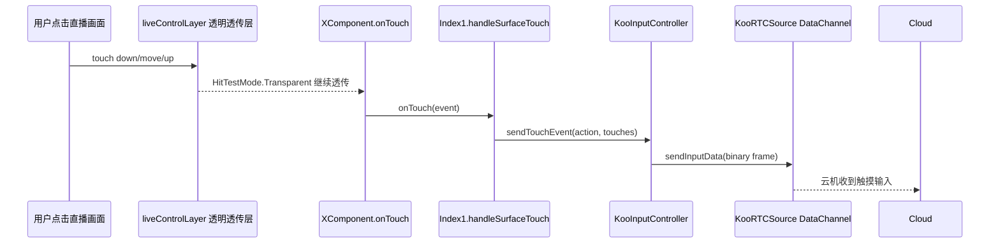

# 2026-06-08 KooPhone 直播画面点击无响应修复报告

## 背景

串流成功后，淘宝直播或抖音直播画面能显示，但在画面内点击没有反应。页面已有 `XComponent.onTouch()`，并且触摸事件会调用 `KooInputController.sendTouchEvent()` 转发给云机，所以本轮重点检查 ArkUI 层级和事件命中路径。

## 根因

`Index1.ets` 为了让“直播状态”“停止直播”等控件显示在 Native surface 之上，额外渲染了一个覆盖在直播画面上的 `liveControlLayer()`。这个控制层宽高等于当前直播槽位，`zIndex` 高于 `XComponent`，但之前没有配置触摸透传。

结果是：大部分点击先命中上方的 ArkUI 控制层，事件没有继续落到下面的 `XComponent.onTouch()`，因此 KooPhone 的触摸输入转发没有被触发。

## 修改内容

只修改 `entry` 模块：

- `entry/src/main/ets/pages/Index1.ets`
  - `streamStatusOverlay()` 增加 `HitTestMode.None`，状态浮层只展示，不接收触摸。
  - `liveControlLayer()` 以及内部全尺寸布局容器增加 `HitTestMode.Transparent`，让容器本身不阻塞下层 `XComponent`。
  - “停止直播”按钮自身保持可点击，点击仍调用 `stopPlatformStream(platform)`。

未修改 `LiveKit` 模块源码。`LiveKit` 继续作为 SDK 使用。

## 修复后的事件路径



## 验证

- `git diff --check`
- `/Applications/DevEco-Studio.app/Contents/tools/ohpm/bin/ohpm install`
- `/Applications/DevEco-CommandLineTools/6.1.1.280/command-line-tools/bin/hvigorw test --no-daemon --stacktrace -p properties.enableSignTask=false`
- `/Applications/DevEco-CommandLineTools/6.1.1.280/command-line-tools/bin/hvigorw clean assembleApp --no-daemon --stacktrace -p properties.enableSignTask=false`

以上均已通过。

## 模拟器状态

本地存在 `Mate_X7_LiveKit` 模拟器实例，但命令行启动后 `hdc list targets` 一直为空，日志出现：

```text
Invalid System-image Path!
HiviewxClient link failed, port should be 1 ~ 65535, your port is 0
```

实例配置为 `deviceType=foldable`，但 `imageSubPath` 指向 `system-image/HarmonyOS-6.1.1/phone_all_arm/`，当前 SDK 目录下未展开 6.1.1 的 `foldable_arm` 目录。因此本轮无法完成模拟器内点击验证。后续接入真实 Mate X7 后，需要验证串流成功后点击云机画面是否能触发云机内应用交互。
