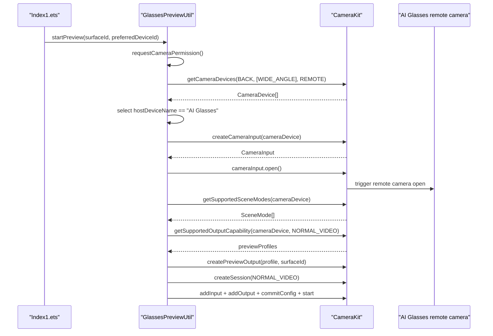

# 2026-06-09 AI Glasses CameraKit 调用链与参数说明

## 结论

本轮只整理和注释 entry 模块里的 AI 眼镜本地预览实验代码，没有修改 `LiveKit` SDK 模块。当前调用链已经做到：通过 HarmonyOS CameraKit 的 `getCameraDevices()` 严格查询 remote camera，优先选择 `CameraDevice.hostDeviceName = AI Glasses` 的设备，再把该 `CameraDevice` 传入 `createCameraInput(cameraDevice)` 并启动 `NORMAL_VIDEO` 预览会话。

真机现象是：应用侧可以枚举并打开 `AI Glasses` remote camera，会话也能进入 `session.start()`；但 AI 眼镜本体会播报“外置隐私灯被遮挡，无法使用此功能”。因此当前问题更像是眼镜侧隐私灯/权限/策略门禁，而不是 entry 页面没有传入眼镜设备，也不是 LiveKit、SFU、IAM 链路问题。

## 代码位置

- 页面入口：`entry/src/main/ets/pages/Index1.ets`
- CameraKit 实验工具：`entry/src/main/ets/rtc/GlassesPreviewUtil.ets`
- 关键入口方法：`GlassesPreviewUtil.startPreview(surfaceId, preferredDeviceId)`
- 关键选择方法：`GlassesPreviewUtil.resolveRemoteCamera(preferredDeviceId)`
- 关键查询方法：`GlassesPreviewUtil.getRemoteCamerasFromConnectionQuery(cameraManager)`

## 端到端调用链



## 输入参数

### `startPreview(surfaceId, preferredDeviceId)`

| 参数 | 来源 | 当前值/形态 | 意义 |
| --- | --- | --- | --- |
| `surfaceId` | `Index1.ets` 中 LiveKit/眼镜预览 XComponent 的 `getXComponentSurfaceId()` | 非空字符串 | CameraKit 预览画面的渲染目标。没有这个 surface，`createPreviewOutput(profile, surfaceId)` 不能创建预览输出。 |
| `preferredDeviceId` | 真机构建时可临时注入；源码中保持占位符 | 通常为空，或完整 remote cameraId | 仅作为优先匹配项。如果它和 `CameraDevice.cameraId` 完全一致，就优先使用该设备。它不是 CameraKit 必填入参。 |

### `getCameraDevices(position, cameraTypes, connectionType)`

```ts
cameraManager.getCameraDevices(
  camera.CameraPosition.CAMERA_POSITION_BACK,
  [camera.CameraType.CAMERA_TYPE_WIDE_ANGLE],
  camera.ConnectionType.CAMERA_CONNECTION_REMOTE
)
```

| 参数 | 当前值 | 意义 |
| --- | --- | --- |
| `position` | `CAMERA_POSITION_BACK`，真机数值为 `1` | 只查询后置方向摄像头。当前 AI Glasses remote camera 返回的是 back。 |
| `cameraTypes` | `[CAMERA_TYPE_WIDE_ANGLE]`，真机数值为 `1` | 只查询广角摄像头。当前 AI Glasses remote camera 返回的是 wide-angle。 |
| `connectionType` | `CAMERA_CONNECTION_REMOTE`，真机数值为 `2` | 只查询远端摄像头，避免把 Mate X7 本机内置摄像头误选为眼镜。 |

### `hostDeviceName = AI Glasses`

`hostDeviceName` 不是传给 CameraKit 的入参，而是 `getCameraDevices()` 返回的 `CameraDevice` 字段。entry 当前用它做二次筛选：

```ts
if (remoteCameras[i].hostDeviceName === 'AI Glasses') {
  return remoteCameras[i]
}
```

这个判断的意义是：只有当系统把 HUAWEI AI Glasses 注册成 remote camera，并且 `CameraDevice.hostDeviceName` 返回 `AI Glasses` 时，entry 才把它作为目标摄像头传给 `createCameraInput(cameraDevice)`。

## 输出参数

### `CameraDevice[]`

`getCameraDevices()` 返回 `CameraDevice[]`。当前页面诊断会打印以下字段：

| 字段 | 示例值 | 意义 |
| --- | --- | --- |
| `cameraId` | `93bf...__Camera_device/0` | 系统给 remote camera 分配的设备 id，后续可作为 `preferredDeviceId` 精确匹配。 |
| `connectionType` | `2` | `2` 对应 `CAMERA_CONNECTION_REMOTE`，说明这是远端摄像头。 |
| `cameraType` | `1` | `1` 对应 `CAMERA_TYPE_WIDE_ANGLE`。 |
| `cameraPosition` | `1` | `1` 对应 `CAMERA_POSITION_BACK`。 |
| `hostDeviceName` | `AI Glasses` | 远端设备主机名，是当前判断眼镜设备的关键字段。 |
| `hostDeviceType` | `2609` | 远端主机类型值，用于辅助确认设备类别；具体语义需要华为侧确认。 |

### `getSupportedSceneModes(cameraDevice)`

返回当前 `CameraDevice` 支持的场景模式列表。真机曾看到 `1,2`，其中当前代码使用 `camera.SceneMode.NORMAL_VIDEO`，真机数值为 `2`。

### `getSupportedOutputCapability(cameraDevice, sceneMode)`

返回当前设备在指定场景下的输出能力。当前代码只使用其中的 `previewProfiles`，并优先选择最接近 `1280x720` 的 profile。

### `createCameraInput(cameraDevice)`

返回 `CameraInput`。这一步是“真实调用 AI 眼镜 CameraDevice”的关键点，因为传入的不是 cameraId 字符串，而是前面从 CameraKit 反参中选出的 `hostDeviceName = AI Glasses` 的完整 `CameraDevice` 对象。

### `cameraInput.open()`

成功后说明 CameraKit 接受了该 remote camera input。真机上这一步会触发 AI 眼镜本体的摄像头启用流程，也就是当前听到“外置隐私灯被遮挡”的阶段。

### `session.start()`

成功后说明 CameraKit 会话已经启动，CameraService 里会出现 active camera session。如果 AI 眼镜侧隐私灯门禁不通过，应用侧仍可能启动到这一步，但眼镜实际视频源不可用或被眼镜侧拒绝。

## 当前隐私灯问题判断

“外置隐私灯被遮挡，无法使用此功能”是 AI 眼镜本体播报，不是 entry 页面错误，也不是 LiveKit SDK 抛错。结合当前代码和诊断，比较合理的判断是：

- entry 已经用标准 CameraKit remote camera 参数选到了 `AI Glasses`。
- 眼镜侧收到启用摄像头的请求后，进入了本体隐私灯检测或使用策略判断。
- 该判断失败后，眼镜拒绝继续提供第一视角能力。

需要继续找华为/眼镜 SDK 侧确认的问题：

- 三方应用通过 CameraKit 打开 AI 眼镜 remote camera 是否需要额外白名单。
- AI 眼镜第一视角是否只开放给畅连、小红书、快手、哔哩哔哩等官方适配场景。
- `hostDeviceType = 2609` 对应的 remote camera 是否还有专用 scene、metadata 或扩展 API。
- “外置隐私灯被遮挡”是否有可调试状态码、传感器状态或恢复步骤。

## 验证命令

```bash
DEVECO_SDK_HOME=/Applications/DevEco-CommandLineTools/6.1.1.280/command-line-tools/sdk \
node /Applications/DevEco-CommandLineTools/6.1.1.280/command-line-tools/hvigor/hvigor/bin/hvigor.js assembleApp --no-daemon --stacktrace
```

```bash
hdc shell hidumper -s CameraService
```

重点看：

- `# Number of Cameras`
- `Camera Connection Type:[Remote]`
- `Camera Type:[Wide-Angle]`
- `Camera Position:[Back]`
- active session 是否为 `Started`
- repeat stream 是否出现 `1280x720`
