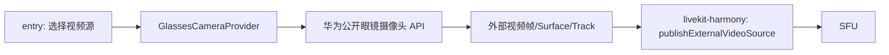

# 2026-06-09 HUAWEI AI Glasses 本地预览诊断报告

## 2026-06-09 最新补充

后续复测时，entry 已经可以通过 CameraKit strict remote 查询选中 `CameraDevice.hostDeviceName = AI Glasses` 的远端摄像头，并把该 `CameraDevice` 传给 `createCameraInput(cameraDevice)` 启动 `NORMAL_VIDEO` 预览会话。也就是说，代码链路已经真实走到了 AI 眼镜 remote camera，而不是只打开 Mate X7 本机摄像头。

当前新的阻塞点是 AI 眼镜本体播报“外置隐私灯被遮挡，无法使用此功能”。这条播报来自 AI 眼镜，不是 entry 页面、LiveKit SDK、SFU 或 IAM 的错误。更详细的入参、反参和字段含义见同目录下 `2026-06-09-ai-glasses-camerakit-call-chain.md`。

## 结论

本轮在 Mate X7 真机上把 SFU 网络因素去掉，只验证“entry 能否直接把 HUAWEI AI Glasses-7667 的摄像头作为 CameraKit remote camera 打开”。最新结论是：entry 可以通过 CameraKit 严格 remote 查询拿到名为 `AI Glasses` 的 remote camera，并能把该 `CameraDevice` 传给 `createCameraInput(cameraDevice)` 启动 `NORMAL_VIDEO` 预览会话。

当前阻塞点已经从“是否能枚举到 AI 眼镜”变成“AI 眼镜本体播报外置隐私灯被遮挡，无法使用此功能”。这说明应用侧已经触发到眼镜侧摄像头启用流程，但眼镜侧隐私灯检测或策略门禁没有通过。

更正说明：前面 CameraKit 非严格路径虽然曾经让预览区出画，但你现场确认那是手机摄像头，不是眼镜摄像头。因此那次结果不能记为成功。后续判断只以严格 remote camera 枚举、`hostDeviceName=AI Glasses`、`CameraService` remote active session 以及眼镜本体反馈为准。

当前关键前提是：AI 眼镜必须先被系统注册成 remote camera。`CameraService` 里出现 `Camera Connection Type:[Remote]` 且页面诊断显示 `hostDeviceName=AI Glasses`，只能证明 entry 选中了 AI 眼镜 remote camera；最终能否输出第一视角，还取决于眼镜本体隐私灯/授权策略是否放行。

2026-06-09 19:35 复测证据：

- 页面诊断文本：`strict remote query: all=2, remote=1`。
- remote 设备：`conn=2, type=1, pos=1, host=AI Glasses, hostType=2609`。
- `CameraService`：`# Number of Cameras:[4]`、`# Number of Active Cameras:[1]`。
- remote cameraId：`93bf0c42736ba0fb10955d6257dd12a7c1dc11e683983c67616488cb82dfaaa9__Camera_device/0`。
- 当前会话：`session state:[Started]`，repeat stream `1280x720`。

因此，本次实验可以证明：这个 API 可以枚举并打开系统注册出来的 `AI Glasses` remote camera。当前下一步不是直接接 LiveKit，而是先确认为什么 AI 眼镜本体在第三方 entry 触发 remote camera 时播报“外置隐私灯被遮挡，无法使用此功能”。

## 实测环境

- 手机：Mate X7 真机
- 眼镜：HUAWEI AI Glasses-7667
- 连接状态：眼镜 App 可以识别设备，日志中显示 `HUAWEI AI Glasses-7667`
- 应用包：`com.hssw.livekit`
- 本轮不连接 SFU，只做本地预览

## 公开资料核对

- 华为 AI 眼镜官网确认该产品具备第一人称视角拍摄、视频录制以及直播/视频通话场景能力，但这些是产品能力说明，不等同于三方 app 可以直接拿到摄像头流。
- 华为 AI 眼镜规格页提到拍摄键按两下可切换直播/视频通话场景的摄像头，说明系统和指定场景里存在“眼镜摄像头参与直播/通话”的能力。
- 华为 CameraKit 开发者页公开的是相机能力/Camera Engine 入口，本轮没有找到面向 HUAWEI AI Glasses 的三方视频源 API、bundle 白名单申请说明或可公开调用的眼镜第一视角流接口。

参考链接：

- [华为 AI 眼镜官网](https://consumer.huawei.com/cn/audio/ai-glasses/)
- [华为 AI 眼镜规格参数](https://consumer.huawei.com/cn/audio/ai-glasses/specs/)
- [华为 CameraKit 开发者页](https://developer.huawei.com/consumer/cn/CameraKit)

## 已尝试方法

### 方法 1：LiveKit SFU 推流链路

早先尝试用 LiveKit 推流路径验证眼镜源，但因为 SFU 和 Koophone 内网在 203 网络，眼镜连接又依赖公网 Wi-Fi，LiveKit WebSocket 在网络层失败，日志为连接失败 `conn fail: 110`。这条链路还没有进入 `RTCEngine.publishVideo()` 或 `createVideoSource({ deviceId })`，因此不能用来判断眼镜摄像头是否可用。

处理方式：本轮解除“必须先云机串流”的限制，改成只做本地预览，不连接 SFU。

### 方法 2：`@ohos/webrtc` 直接指定 remote cameraId

曾尝试让 SDK 的 `createVideoSource()` 使用系统暴露的 remote cameraId。结果不可靠：

- 普通 `deviceId` 约束下，预览区能出画，但用户肉眼确认是手机摄像头，不是眼镜摄像头。
- 改成严格 `deviceId: { exact: remoteCameraId }` 后，路径不再稳定。
- 其中一次触发了 native 崩溃，faultlog 关键栈为 `libohos_webrtc.so` 和 `NapiRequestPermission::RequestPermissionsFromUser`，错误为 `String::CheckCast value is not napi_string`。

结论：不能用这个方法证明眼镜可用；它要么回退/显示手机摄像头，要么落到 WebRTC native/权限链路崩溃风险。

### 方法 3：CameraKit 非严格 remote 枚举

新增 `entry/src/main/ets/rtc/GlassesPreviewUtil.ets`，不走 SFU，也不走 `@ohos/webrtc`，只用 CameraKit：

```ts
const cameraManager = camera.getCameraManager(context)
const cameraInput = cameraManager.createCameraInput(cameraDevice)
await cameraInput.open()
const previewOutput = cameraManager.createPreviewOutput(previewProfile, surfaceId)
const session = cameraManager.createSession(camera.SceneMode.NORMAL_PHOTO)
session.beginConfig()
session.addInput(cameraInput)
session.addOutput(previewOutput)
await session.commitConfig()
await session.start()
```

现象：

- 某次 CameraService 能枚举到一个 remote cameraId，后缀为 `__Camera_device/0`，设备名显示为 `AI Glasses`。
- CameraService 日志显示 remote camera 被创建过。
- 但用户实际看预览画面后确认仍是手机摄像头，不是眼镜第一视角。
- 日志里同时出现了 `device/0` 的相机状态事件，说明系统/眼镜 App 侧存在回退或桥接行为，不能把 “remote camera 状态出现过” 等同于 “应用拿到了眼镜画面”。

结论：该方法不成立。

### 方法 4：CameraKit 严格 remote + `NORMAL_VIDEO`

为了避免任何回退，本轮把代码改成只接受下面这个公开 API 返回的设备：

```ts
cameraManager.getCameraDevices(
  camera.CameraPosition.CAMERA_POSITION_BACK,
  [camera.CameraType.CAMERA_TYPE_WIDE_ANGLE],
  camera.ConnectionType.CAMERA_CONNECTION_REMOTE
)
```

并且把会话从 `NORMAL_PHOTO` 改成 `NORMAL_VIDEO`。

早先结果：

- 严格查询返回空。
- CameraService 显示只有 3 个内置摄像头：`device/0`、`device/3`、`device/6`，全部是 `Builtin`。
- 页面显示错误：`当前系统没有通过 CAMERA_CONNECTION_REMOTE 返回眼镜摄像头`。
- 关键日志：`GetCameraDevices no camera devices found with parameters: position=1, connectionType=2`。

最新复测结果：

- 严格查询返回 1 个 remote camera。
- 页面显示 `remote[0] ... conn=2 ... host=AI Glasses`。
- XComponent 预览区出画。
- CameraService 显示 1 个 active camera session，repeat stream 为 1280x720。
- AI 眼镜本体播报：`外置隐私灯被遮挡，无法使用此功能`。

结论：系统注册 AI 眼镜 remote camera 后，CameraKit 严格 remote 路径可启动；当前阻塞在眼镜本体隐私灯检测或策略门禁。

### 方法 5：拉起华为眼镜 App 主入口

执行：

```bash
aa start -b com.huawei.hmos.visionglass -a EntryAbility
```

结果：

- 眼镜 App 首页能显示 `HUAWEI AI Glasses-7667`。
- “直播与通话 / 第一视角交流”卡片处于灰态，点击无跳转。
- 拉起眼镜 App 后 CameraService 仍只有 3 个 `Builtin` 摄像头，没有 remote camera。

结论：眼镜 App 连接成功不等于 remote camera 注册给三方应用。

### 方法 6：拉起眼镜 App 协同服务/分布式扩展

从 `bm dump -n com.huawei.hmos.visionglass` 看到了这些能力：

- `CooperationServiceExtAbility`
- `GlassesServiceExtAbility`
- `CooperationDistributedExtAbility`
- metadata：`com.huawei.hmos.watch.distributedCamera`

尝试拉起结果：

```bash
aa start -b com.huawei.hmos.visionglass -a CooperationServiceExtAbility
aa start -b com.huawei.hmos.visionglass -a GlassesServiceExtAbility
aa start -b com.huawei.hmos.visionglass -a CooperationDistributedExtAbility
```

结果：

- `CooperationServiceExtAbility` 和 `GlassesServiceExtAbility` 可以启动，但不会注册 remote camera。
- `CooperationDistributedExtAbility` 被系统拒绝，错误为 `Permission check failed when launching the ability`。
- `HiWearAbility` 也因目标 ability 不可见被拒绝。

结论：三方 entry 不能主动启动眼镜的分布式相机通道。

### 方法 7：读取眼镜 App 数据源

眼镜 App 暴露了 datashare URI：

- `datashareproxy://com.huawei.hmos.visionglass/glassesDevice`
- `datashareproxy://com.huawei.hmos.visionglass/photo_import_data`
- `datashareproxy://com.huawei.hmos.visionglass/ai_data`

但权限要求是系统级：

- `ohos.permission.MANAGE_BLUETOOTH`
- `ohos.permission.MANAGE_SETTINGS`
- `ohos.permission.WAKEUP_VOICE`

结论：这些数据源不是普通三方应用可读取的公开摄像头流入口。

## 关键证据

截图：

- `/tmp/visionglass_entry.jpeg`：眼镜 App 首页识别到 `HUAWEI AI Glasses-7667`。
- `/tmp/livekit_remote_video_after_allow.jpeg`：严格 remote 查询失败后，entry 页面提示没有 `CAMERA_CONNECTION_REMOTE` 眼镜摄像头。
- `/tmp/livekit_after_permission_allow.jpeg`：非严格 CameraKit 路径曾出画，但用户确认是手机摄像头，不是眼镜。

日志/命令：

```bash
hidumper -s CameraService
```

早先严格模式失败结果：

```text
# Number of Cameras:[3]
# Number of Active Cameras:[0]
# Camera ID:[device/0] Camera Connection Type:[Builtin]
# Camera ID:[device/3] Camera Connection Type:[Builtin]
# Camera ID:[device/6] Camera Connection Type:[Builtin]
```

严格 remote 查询失败：

```text
GetCameraDevices no camera devices found with parameters: position=1, connectionType=2
No CAMERA_CONNECTION_REMOTE camera found
```

最新复测结果：

```text
# Number of Cameras:[4]
# Number of Active Cameras:[1]
# Camera ID:[93bf0c42736ba0fb10955d6257dd12a7c1dc11e683983c67616488cb82dfaaa9__Camera_device/0]
## Camera Connection Type:[Remote]
Client pid:[16320]
session state:[Started]
repeat stream width:[1280] height:[720]
```

分布式扩展启动失败：

```text
Error Code:10107101
Error Message:Permission check failed when launching the ability
```

## 代码改动

本轮只改 entry：

- `entry/src/main/ets/pages/Index1.ets`
  - 增加 `LIVEKIT_EXPERIMENT_PREVIEW_ONLY = true`。
  - 顶部推流按钮改为“开始眼镜预览 / 关闭眼镜预览”。
  - 点击开始时走 `startGlassesPreviewOnly()`，不连接 SFU。
  - 点击关闭时调用 `glassesPreviewUtil.stopPreview()`。

- `entry/src/main/ets/rtc/GlassesPreviewUtil.ets`
  - 新增 CameraKit 本地预览实验工具。
  - 请求 `ohos.permission.CAMERA`。
  - 严格通过 `CAMERA_CONNECTION_REMOTE` 查询眼镜摄像头。
  - 使用 `NORMAL_VIDEO` session 把预览输出绑定到 XComponent surface。

没有修改 `LiveKit` SDK 模块。

## 需要华为或 SDK 侧补充的能力

如果这个需求要真正打通，需要以下任一能力：

1. 华为提供 HUAWEI AI Glasses 的公开摄像头 SDK/API，让三方应用能打开眼镜第一视角视频流。
2. 华为把我们的 bundle 加入眼镜“第一视角交流/直播”能力白名单，让 CameraKit 稳定返回真实眼镜 camera device。
3. 华为提供可被三方应用调用的 Surface/帧数据输出接口，例如 YUV/RGBA frame callback、PixelMap stream、MediaStreamTrack 或 external video source。
4. LiveKit SDK 增加外部视频源发布能力：entry 拿到眼镜帧后，通过 SDK 发布，而不是 SDK 内部自己打开手机摄像头。

推荐架构是：



entry 负责 UI、权限、选择“本机摄像头/眼镜摄像头”；LiveKit SDK 负责把 entry 提供的外部视频源发布到 SFU。

## 最终判断

在当前 Mate X7 + HUAWEI AI Glasses-7667 条件下，只要系统已经把眼镜注册为 `CAMERA_CONNECTION_REMOTE`，entry 可以用 CameraKit 把 AI 眼镜 remote camera 预览到 demo 里。当前已经验证到严格 remote 查询和本地预览成立。

但当前还没有稳定拿到眼镜第一视角画面，阻塞原因是 AI 眼镜本体播报“外置隐私灯被遮挡，无法使用此功能”。所以最终判断是：

- `getCameraDevices(..., CAMERA_CONNECTION_REMOTE)` 是正确的 remote camera API。
- 这个 API 能枚举到 `host=AI Glasses` 的设备。
- entry 已经把 `host=AI Glasses` 的 `CameraDevice` 传给 `createCameraInput(cameraDevice)` 并启动了 `NORMAL_VIDEO` 会话。
- 在接 LiveKit 推流前，必须先确认眼镜侧隐私灯检测/白名单/场景授权为什么拒绝第三方 entry 使用第一视角。
