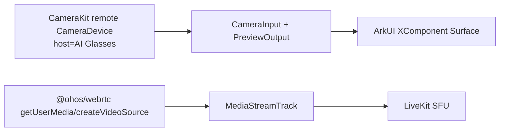

# AI 眼镜摄像头接入 LiveKit 推流诊断结论

日期：2026-06-11
设备：HUAWEI Mate X7 `DEL-AL10 6.1.0.125(SP22DEMC735E111R3P1log)`
包名：`com.samples.ndkopengl`
分支：`dev_all_in`

## 2026-06-11 追加修复：去掉 AI 眼镜推流里的录屏路径

本轮定位到“出现 label 录屏弹窗”的直接原因：

```text
Index1.publishLiveKitVideoForSwitch()
  -> LiveKitUtil.publishDisplayVideo()
  -> LiveKitClient.publishDisplayVideo()
  -> RTCEngine.publishDisplayVideo()
  -> @ohos/webrtc MediaDevices.getDisplayMedia()
```

`getDisplayMedia()` 是屏幕采集接口，系统会弹出录屏授权，并用应用 label 标识被采集应用。它只能采集页面内容，不能代表 AI 眼镜摄像头第一视角，所以这条链路已从 AI 眼镜推流入口移除。

当前 AI 眼镜推流只走真实摄像头链路：

```text
GlassesPreviewUtil.resolveAiGlassesCameraId()
  -> LiveKitUtil.publishVideo(surfaceId, remoteCameraId)
  -> LiveKitClient.publishVideo()
  -> RTCEngine.publishVideo()
  -> @ohos/webrtc MediaDevices.getUserMedia({ video: { deviceId: remoteCameraId } })
```

同时在 `RTCEngine.createMediaDevicesVideoTrack()` 增加了防回退保护：

- 如果传入的是 AI 眼镜 remote cameraId；
- 但 `@ohos/webrtc MediaDevices.enumerateDevices()` 没有枚举到同一个 deviceId；
- 则直接失败并提示：`当前 @ohos/webrtc 未暴露 AI 眼镜 remote camera，已停止推流，避免回退到手机摄像头或录屏`。

这保证了 demo 不会再把手机摄像头或页面录屏误当成 AI 眼镜画面发布。

## 结论

当前 demo 不能稳定把 AI 眼镜第一视角视频直接推到 SFU，不是简单的 entry 业务逻辑问题。

已经验证到两层阻断：

1. CameraKit 层可以枚举到 `hostDeviceName = AI Glasses` 的 remote camera，但创建预览会话后，系统的 `xr_glass_app_service` / `dcamera` 会把链路停止，并强制切回本机 `device/0`。
2. `@ohos/webrtc` 当前公开 ArkTS API 只能通过 `getUserMedia()` / `createVideoSource(constraints)` 创建摄像头 Track，不能接收 CameraKit 的 `CameraDevice` 或外部视频帧；`enumerateDevices()` 也没有返回 AI Glasses remote camera。

所以真正可行的正解需要 SDK 或系统侧开放其中一种能力：

- 让我们的 bundle 具备 AI 眼镜第一视角使用授权；
- 提供 AI 眼镜第一视角视频源 SDK；
- 让 `@ohos/webrtc` 能创建/选择真实 remote camera track；
- 或提供 CameraKit 帧到 WebRTC Track 的外部帧注入接口。

## 本轮代码变更

### `entry/src/main/module.json5`

新增普通运行时权限：

```json5
{
  "name": "ohos.permission.ACCESS_BLUETOOTH",
  "reason": "$string:permission_bluetooth_reason",
  "usedScene": {
    "abilities": [
      "EntryAbility"
    ],
    "when": "inuse"
  }
}
```

保留跨设备协同权限：

```json5
{
  "name": "ohos.permission.DISTRIBUTED_DATASYNC",
  "reason": "$string:permission_distributed_datasync_reason",
  "usedScene": {
    "abilities": [
      "EntryAbility"
    ],
    "when": "inuse"
  }
}
```

### `entry/src/main/resources/base/element/string.json`

新增蓝牙权限原因：

```json
{
  "name": "permission_bluetooth_reason",
  "value": "需要访问蓝牙连接以协同 AI 眼镜摄像头"
}
```

### `entry/src/main/ets/rtc/GlassesPreviewUtil.ets`

`requestCameraPermission()` 现在一次性请求三项权限：

```ts
const result = await atManager.requestPermissionsFromUser(this.context, [
  'ohos.permission.CAMERA',
  'ohos.permission.ACCESS_BLUETOOTH',
  'ohos.permission.DISTRIBUTED_DATASYNC'
])
```

校验顺序：

```ts
const cameraGranted = result.authResults.length > 0 && result.authResults[0] === 0
const bluetoothGranted = result.authResults.length > 1 && result.authResults[1] === 0
const distributedGranted = result.authResults.length > 2 && result.authResults[2] === 0
```

目的：排除 AI 眼镜蓝牙连接、跨设备协同权限不足导致 remote camera 被拒绝的可能。

## 实验记录

### 1. `DISTRIBUTED_DATASYNC` 权限实验

日志文件：

- `logs/2026-06-11-ai-distributed-permission-run1.log`
- `logs/2026-06-11-ai-after-distributed-allow-run2.log`

结果：

- 系统弹出“发现和连接附近的设备”授权框。
- 授权后仍然失败。

关键日志：

```text
[AI_GLASS_DBG] getCameraDevices.remoteReturn[0] ... conn=2, type=1, pos=1, host=AI Glasses, hostType=2609
[AI_GLASS_DBG] selected reason=hostDeviceName AI Glasses ...
[AI_GLASS_DBG] cameraInput error code=7400201 ...
[distributedcamerahdf][Notify] ... result = -9, content = sink stop dcamera business.
McuNotifyForceSwitchLocalCamera ... destCameraId = device/0
SoftBusSocketGetError# getsockopt ... errno=Permission denied
```

解释：

- entry 确实选中了 AI Glasses remote camera。
- CameraKit 创建 remote camera 输入后，眼镜服务/分布式相机服务主动停止业务。
- 系统随后强制切回本机摄像头 `device/0`。

### 2. `ACCESS_XR_GLASSES` 系统权限实验

`PermissionDefinitions.json` 中存在：

```json
{
  "name": "ohos.permission.ACCESS_XR_GLASSES",
  "grantMode": "system_grant",
  "availableLevel": "system_basic",
  "availableType": "SYSTEM",
  "distributedSceneEnable": true,
  "deviceTypes": [
    "phone"
  ]
}
```

临时声明该权限后构建可以通过，但安装失败：

```text
install failed due to grant request permissions failed.
PermissionName: ohos.permission.ACCESS_XR_GLASSES
```

解释：

- 该权限不是普通三方应用可以通过运行时弹窗获取的权限。
- 当前 debug 签名/Profile 无法被授予该系统级 XR 眼镜能力。

这项临时声明已经撤掉，当前可安装包不包含 `ACCESS_XR_GLASSES`。

### 3. `ACCESS_BLUETOOTH` 权限实验

日志文件：

- `logs/2026-06-11-ai-bluetooth-permission-attempt2.log`

结果：

- 包可以安装。
- 点击 AI 眼镜按钮时，当前设备状态下系统没有再暴露 remote camera：

```text
[GlassesPreviewUtil] query remote camera by connection type failed: Error: cameraDeviceList is null.
[GlassesPreviewUtil] camera diagnostics: strict remote query failed: Error: cameraDeviceList is null.: all=2, remote=0
```

解释：

- 这次没有进入 AI 眼镜真实 CameraInput 链路，因为 CameraKit 当前只返回本机摄像头。
- 蓝牙权限本身没有破坏应用，建议保留；但它不是解决强制切本机的关键权限。

### 4. WebRTC remote camera 验证

日志文件：

- `logs/2026-06-11-ai-switch-webrtc-enumerate-live.log`

关键日志：

```text
[RTCEngine] WebRTC enumerateDevices count: 8
[RTCEngine] WebRTC device[0] kind=videoinput, label=Build_in Back (device/0), deviceId=device/0, matchesCameraKitRemote=false
[RTCEngine] WebRTC device[1] kind=videoinput, label=Build_in Front (device/6), deviceId=device/6, matchesCameraKitRemote=false
[RTCEngine] Request remote camera by MediaDevices.getUserMedia: ai_glasses:93bf0c...vice/0
[RTCEngine] Remote camera getUserMedia video track: ...
CameraPreOn CameraId is not glassCamera, PreOn CameraId : device/0
CheckAppInWhiteList: appName :com.samples.ndkopengl
```

解释：

- `MediaDevices.enumerateDevices()` 没有 AI Glasses remote camera。
- 即使把 CameraKit 拿到的 remote `cameraId` 传给 WebRTC，WebRTC 仍然走本机 `device/0`。
- 这就是“当前预览/推流看起来还是手机画面”的直接原因。

## 为什么不能“直接替换视频”

手机摄像头和 AI 眼镜摄像头最终都是视频，但在当前公开 API 里，它们不处在同一个可替换抽象层。

当前链路是：



问题在于：`B/C` 和 `D/E` 之间没有公开桥接接口。
当前 `@ohos/webrtc` 类型文件只提供：

```ts
interface MediaDevices {
  enumerateDevices(): Promise<MediaDeviceInfo[]>
  getUserMedia(constraints?: MediaStreamConstraints): Promise<MediaStream>
  getDisplayMedia(options?: DisplayMediaStreamOptions): Promise<MediaStream>
}

interface PeerConnectionFactory {
  createVideoSource(constraints?: MediaTrackConstraints, isScreencast?: boolean): VideoSource
  createVideoTrack(id: string, source: VideoSource): VideoTrack
}
```

没有看到 `pushFrame`、`writeFrame`、`VideoFrame`、`ExternalVideoSource` 这类外部帧注入能力。
因此 entry 不能把 CameraKit 的预览 surface 或帧直接塞进 LiveKit 的 WebRTC Track。

## 当前可继续推进的方案

### 方案 A：系统/眼镜侧授权

找华为眼镜/系统侧确认：

- 是否能把 `com.samples.ndkopengl` 或正式 bundle 加入 AI 眼镜第一视角白名单；
- 是否能授予或豁免 `ACCESS_XR_GLASSES` / `MANAGE_CAMERA_CONFIG` / 眼镜内部直播场景权限；
- 是否有非公开 AI 眼镜第一视角 SDK。

这是最直接路径。

### 方案 B：SDK 提供 CameraKit 到 WebRTC Track 桥接

需要 LiveKit SDK 或底层 native 层提供：

- 接收 CameraKit / ImageReceiver 帧；
- 转成 WebRTC 可发布的视频轨道；
- 对外暴露 `publishExternalVideoTrack()` 或 `publishCameraKitFrames()`。

但当前还缺一个前提：AI 眼镜 CameraKit 会话必须能稳定输出帧。现在日志显示会话会被眼镜服务停止。

### 方案 C：WebRTC HAR 支持 remote camera

如果后续 `@ohos/webrtc` 版本能让 `enumerateDevices()` 返回 AI Glasses remote camera，并且 `getUserMedia({ video: { deviceId } })` 真正打开 remote camera，那么 entry 侧当前的 deviceId 切换逻辑可以复用。

## 验证命令

```sh
export DEVECO_SDK_HOME=/tmp/livekit-harmony-sdk-wrapper
export PATH="/Applications/DevEco-Studio.app/Contents/tools/node/bin:/Applications/DevEco-Studio.app/Contents/tools/ohpm/bin:/Applications/DevEco-Studio.app/Contents/tools/hvigor/bin:/Applications/DevEco-Studio.app/Contents/sdk/default/openharmony/toolchains:$PATH"
git diff --check
/Applications/DevEco-Studio.app/Contents/tools/hvigor/bin/hvigorw assembleApp --no-daemon --stacktrace
hdc install -r entry/build/default/outputs/default/entry-default-signed.hap
```

最新安装结果：

```text
install bundle successfully
```

截图：

- `/tmp/livekit-ai-distributed-permission-run1.jpeg`
- `/tmp/livekit-after-distributed-allow.jpeg`
- `/tmp/livekit-ai-after-distributed-allow-run2.jpeg`
- `/tmp/livekit-ai-bluetooth-permission-attempt2.jpeg`
